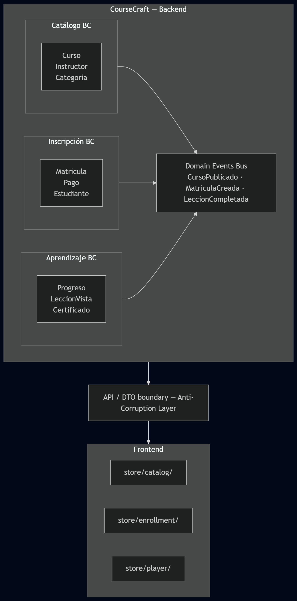

<!-- _class: title -->
<!-- _paginate: false -->

<br>

# **El modelo anémico**
# **te está <span>mintiendo</span>**

<br>

### DDD Práctico con .NET 9 — CourseCraft como caso de estudio

<br>

**Jose Luis Avila** — Backend  &nbsp;·&nbsp;  **Brandon Rodriguez** — Frontend

*Charla de 30 minutos*

---

<!-- _footer: "Bloque 1 — Introducción | 2 min" -->

## Estructura de la charla

| Bloque | Quién | Tema | Tiempo |
|--------|-------|------|--------|
| 1 | Ambos | Gancho + proyecto demo | 2 min |
| 2 | Backend | El modelo anémico | 4 min |
| 3 | Backend | Ubiquitous Language | 3 min |
| 4 | Backend | Bloques tácticos en .NET | 8 min |
| 5 | Transición | "El frontend también tiene dominio" | 1 min |
| 6 | Frontend | DDD en el frontend | 5 min |
| 7 | Ambos | Bounded Contexts + Domain Events | 5 min |
| 8 | Ambos | Las 3 mentiras de DDD | 2 min |

---

<!-- _footer: "Bloque 1 — Introducción | 2 min" -->

## ¿Reconocen esta clase?

```csharp
// Esto existe en TODOS los proyectos .NET grandes
public class UserService
{
    void CreateUser(string name, string email, string roleId) { ... }
    void UpdateUser(int id, string name, string email)        { ... }
    void DeactivateUser(int id)                                { ... }
    void AssignRole(int userId, string roleId)                 { ... }
    void SendVerificationEmail(int userId)                     { ... }
    void ResetPassword(int userId, string newPassword)         { ... }
    bool ValidateCredentials(string email, string password)    { ... }
    // ... 20 métodos más
}
```

> *"Este es el síntoma. En 30 minutos van a entender por qué pasa y cómo salir de ahí."*

---

<!-- _footer: "Bloque 1 — Introducción | 2 min" -->
<!-- _class: impact -->

## El proyecto de hoy

<br>

### **CourseCraft**
Plataforma de cursos online — tipo Udemy simplificado

<br>

Un "Curso" significa cosas **distintas** para catálogo, pagos y aprendizaje

Las reglas de negocio están dispersas en **12 Services distintos**

**EF Core está dictando cómo diseñar el dominio** — y no debería

---

<!-- _class: impact -->
<!-- _paginate: false -->

## BLOQUE 2

# El modelo anémico:
## el enemigo silencioso de .NET

---

<!-- _footer: "Bloque 2 — Modelo anémico | 4 min" -->

## El modelo anémico <span class="tag tag-bad">Anti-patron</span>

```csharp
// Solo tiene datos, cero comportamiento
public class Curso
{
    public int Id { get; set; }
    public string Titulo { get; set; }
    public decimal Precio { get; set; }
    public bool EstaPublicado { get; set; }   // ← backdoor abierto
    public List<Leccion> Lecciones { get; set; }
}

// Toda la lógica vive LEJOS de los datos que protege
public class CursoService
{
    public void PublicarCurso(int cursoId)
    {
        var curso = _repo.GetById(cursoId);
        if (curso.Lecciones.Count < 5) throw new Exception("Mínimo 5 lecciones");
        if (curso.Precio <= 0) throw new Exception("Precio inválido");
        curso.EstaPublicado = true;  // cualquiera puede hacer esto desde un Controller
        _repo.Save(curso);
    }
}
```

**Problema real:** `curso.EstaPublicado = true` desde un Controller salta todas las validaciones. EF Core lo permite sin chistar.

---

<!-- _footer: "Bloque 2 — Modelo anémico | 4 min" -->

## Dominio rico <span class="tag tag-good">DDD</span>

```csharp
public class Curso
{
    private readonly List<Leccion> _lecciones = new();
    public IReadOnlyCollection<Leccion> Lecciones => _lecciones.AsReadOnly();

    public string Titulo { get; private set; }
    public Dinero Precio { get; private set; }
    public EstadoCurso Estado { get; private set; }

    public void Publicar()
    {
        if (_lecciones.Count < 5)
            throw new DomainException("Mínimo 5 lecciones para publicar");
        if (Estado == EstadoCurso.Publicado)
            throw new DomainException("El curso ya está publicado");

        Estado = EstadoCurso.Publicado;
    }
}
```

Con setter privado, `EstaPublicado = true` desde un Controller ya no compila. Las reglas viven junto a los datos que protegen.

---

<!-- _class: impact -->
<!-- _paginate: false -->

## BLOQUE 3

# Ubiquitous Language:
## lo político antes que lo técnico

---

<!-- _footer: "Bloque 3 — Ubiquitous Language | 3 min" -->

## ¿Qué es un "Estudiante"?

<br>

| Equipo | Define "Estudiante" como... |
|--------|-----------------------------|
| **Ventas** | Cualquier persona que compró un curso |
| **Soporte** | Cualquier persona con cuenta activa |
| **Aprendizaje** | Alguien activo en un curso específico |

<br>

> Los tres equipos tienen razón. Y el código termina siendo un desastre.

---

<!-- _footer: "Bloque 3 — Ubiquitous Language | 3 min" -->

## La solución: aceptar que depende del contexto

```csharp
// ❌ Un solo concepto para todo → ambigüedad
public class UserService
{
    public List<User> GetStudents()        { }  // ¿cuáles?
    public List<User> GetActiveStudents()  { }  // ¿activos en qué?
    public List<Enrollment> GetStudentCourses() { }  // ¿ahora es Enrollment?
}
```

```csharp
// ✅ Cada contexto tiene su propio lenguaje
namespace Ventas     { public class Comprador   { } }  // quien pagó
namespace Inscripcion{ public class Matricula   { } }  // relación activa con un curso
namespace Soporte    { public class UsuarioCuenta{ } } // tiene cuenta
```

<br>

> **El test de lenguaje ubicuo:** si tienes que explicar qué hace una clase, el nombre falló.

---

<!-- _class: impact -->
<!-- _paginate: false -->

## BLOQUE 4

# Bloques tácticos en C#
## con las trampas que nadie documenta

---

<!-- _footer: "Bloque 4 — Value Objects | 8 min" -->

## Value Objects: el error más común al aprender DDD

```csharp
// ❌ "Aprendí DDD" — solo agregué ruido
public record CursoId(Guid Value);
public record UsuarioId(Guid Value);
public record LeccionId(Guid Value);
// ¿Qué validación o comportamiento agregué? Ninguno.
```

Un Value Object **justifica su existencia** cuando encapsula validación o comportamiento:

```csharp
// ✅ Encapsula validación y normalización
public record Email
{
    public string Valor { get; }
    public Email(string valor)
    {
        if (!valor.Contains('@')) throw new DomainException($"'{valor}' no es un email válido");
        Valor = valor.Trim().ToLowerInvariant();  // normalización automática
    }
    // Nunca más validar email en 15 lugares del código
}
```

---

<!-- _footer: "Bloque 4 — Value Objects | 8 min" -->

## Value Object con comportamiento: `Dinero`

```csharp
public record Dinero
{
    public decimal Monto { get; }
    public string Moneda { get; }

    public Dinero(decimal monto, string moneda)
    {
        if (monto < 0) throw new DomainException("El monto no puede ser negativo");
        Monto = monto;
        Moneda = moneda.ToUpperInvariant();
    }

    public Dinero Aplicar(Descuento descuento) =>
        new(Monto * (1 - descuento.Porcentaje), Moneda);

    public Dinero Sumar(Dinero otro)
    {
        if (Moneda != otro.Moneda)
            throw new DomainException("No se pueden sumar monedas distintas");
        return new(Monto + otro.Monto, Moneda);
    }
}
```

**EF Core:** `OwnsOne(c => c.Precio)` — sin tabla extra, aplana las columnas en la misma tabla.

---

<!-- _footer: "Bloque 4 — Aggregates | 8 min" -->

## Aggregates: la pregunta que resuelve el dilema

¿`Curso` debería contener `Lecciones`?

```csharp
// Si Leccion es parte del Aggregate Curso:
// → cargas 500 objetos cada vez que haces CUALQUIER cosa con el curso

// Si Leccion es su propio Aggregate:
public class Leccion
{
    public LeccionId Id { get; }
    public CursoId CursoId { get; }   // referencia por ID, no por objeto
    public string Titulo { get; private set; }
    public void Renombrar(string nuevoTitulo) { ... }
}
```


### La pregunta que resuelve el dilema:
> *¿Existe una regla de negocio que requiere **consistencia entre ambos** en la misma transacción?*

"Un curso publicado no puede quedar sin lecciones" → **van juntos**
"Un estudiante marca una lección como completada" → **van separados**

---

<!-- _footer: "Bloque 4 — EF Core tricks | 8 min" -->

## EF Core + DDD: los trucos que no están en los tutoriales

```csharp
modelBuilder.Entity<Curso>(builder =>
{
    // ① Backing field para colección privada
    builder.Navigation(c => c.Lecciones)
           .UsePropertyAccessMode(PropertyAccessMode.Field);

    // ② Enum como string en BD — legible sin joins
    builder.Property(c => c.Estado)
           .HasConversion<string>();

    // ③ Value converter para Typed IDs
    builder.Property(c => c.InstructorId)
           .HasConversion(id => id.Value, value => new InstructorId(value));

    // ④ Value Object como columnas planas (sin tabla extra)
    builder.OwnsOne(c => c.Precio, p => {
        p.Property(x => x.Monto).HasColumnName("precio_monto");
        p.Property(x => x.Moneda).HasColumnName("precio_moneda");
    });
});
```

---

<!-- _footer: "Bloque 4 — EF Core tricks | 8 min" -->

## El problema del constructor con EF Core

```csharp
public class Curso
{
    // ✅ Constructor de dominio — con todas las validaciones
    public Curso(string titulo, InstructorId instructor, Dinero precio)
    {
        if (string.IsNullOrWhiteSpace(titulo))
            throw new DomainException("El título es requerido");
        Titulo = titulo;
        InstructorId = instructor;
        Precio = precio;
        Estado = EstadoCurso.Borrador;
    }

    // ✅ Constructor privado para EF Core — sin validaciones
    // EF reconstruye desde BD: los datos YA fueron validados al guardarse
    private Curso() { }
}
```

> *EF Core necesita crear objetos vacíos para hidratar desde la base de datos. El constructor privado es el acuerdo de paz entre el ORM y el dominio.*

---

<!-- _footer: "Bloque 4 — MediatR | 8 min" -->

## MediatR: Command vs Handler

```csharp
// Command — expresa la INTENCIÓN del usuario (no es un DTO de HTTP)
public record PublicarCursoCommand(Guid CursoId, Guid InstructorId) : IRequest<Result>;

// Handler — ORQUESTA, no tiene lógica de negocio
public class PublicarCursoHandler : IRequestHandler<PublicarCursoCommand, Result>
{
    public async Task<Result> Handle(PublicarCursoCommand cmd, CancellationToken ct)
    {
        var curso = await _cursoRepo.GetByIdAsync(new CursoId(cmd.CursoId));

        if (curso is null) return Result.Failure("Curso no encontrado");
        if (curso.InstructorId.Value != cmd.InstructorId)
            return Result.Failure("No autorizado");

        curso.Publicar();                                    // el DOMINIO hace su trabajo
        await _cursoRepo.SaveAsync(curso);
        await _dispatcher.DispatchAsync(curso.DomainEvents); // eventos después de guardar

        return Result.Success();
    }
}
```

---

<!-- _class: impact -->
<!-- _paginate: false -->

## TRANSICION

<br>

### *"El backend definió el dominio con .NET.*
### *Pero hay una pregunta pendiente:"*

<br>

# ¿El frontend tiene dominio propio
# o es solo una pantalla?

<br>

### **Brandon Rodriguez** va a responder eso.

---

<!-- _class: impact -->
<!-- _paginate: false -->

## BLOQUE 7

# Bounded Contexts
## y el puente backend ↔ frontend

---

<!-- _footer: "Bloque 7 — Bounded Contexts | 5 min" -->

## El diagrama que une ambas charlas



---

<!-- _footer: "Bloque 7 — Domain Events | 5 min" -->

## Domain Events: el protocolo de toda la aplicación

```csharp
// Evento definido en el DOMINIO
public record CursoPublicado(
    CursoId CursoId, string Titulo, InstructorId InstructorId, DateTimeOffset OcurridoEn
) : IDomainEvent;

// Notificaciones reacciona — sin que Catálogo lo sepa
public class NotificarInstructorHandler : INotificationHandler<CursoPublicado>
{
    public async Task Handle(CursoPublicado ev, CancellationToken ct)
        => await _email.EnviarNotificacion(ev.InstructorId, ev.Titulo);
}
```

Los Domain Events **no son mensajería interna del backend**. Son el protocolo de toda la aplicación:

```
CursoPublicado    → SignalR → Frontend: actualiza catálogo en tiempo real
MatriculaCreada   → SignalR → Frontend: habilita acceso al contenido
LeccionCompletada → SignalR → Frontend: actualiza barra de progreso
```

---

<!-- _class: impact -->
<!-- _paginate: false -->

## BLOQUE 8

# Las 3 mentiras de DDD

---

<!-- _footer: "Bloque 8 — Cierre | 2 min" -->

## Las 3 mentiras que te cuentan sobre DDD

<br>

**Mentira #1: "DDD es solo para sistemas grandes"**
*Ubiquitous Language y Value Objects aplican hasta en proyectos de 2 semanas.*
Lo que escala es el diseño estratégico — no tienes que usar todos los patrones.

<br>

**Mentira #2: "El dominio no debe conocer nada de infraestructura"**
*Un atributo de EF Core en una entidad no destruye tu arquitectura.*
Lo que sí la destruye: lógica de negocio en un `DbContext`, un `Controller`, o una `Migration`.

<br>

**Mentira #3: "Si haces DDD bien, la arquitectura emerge sola"**
*DDD te da las herramientas, pero alguien tiene que tomar las decisiones difíciles.*
¿Cuándo una validación es lógica de dominio vs lógica de aplicación? DDD no responde eso.

---

<!-- _class: title -->
<!-- _paginate: false -->

<br>

## El takeaway final

<br>

# *"DDD no es sobre patrones.*
# *Es sobre tener conversaciones honestas con el negocio*
# *y tener el coraje de que se reflejen exactamente en el código."*

<br>


<!-- _paginate: false -->

## 

<br>

| Recurso | Por qué vale la pena |
|---------|---------------------|
| *Implementing Domain-Driven Design* — Vernon | El libro de referencia de DDD táctico |
| *Domain-Driven Design* — Evans | El libro original (más denso, más estratégico) |
| **eShopOnContainers** — Microsoft | DDD real en .NET con microservicios |
| **ardalis/CleanArchitecture** — Steve Smith | Template DDD + Clean Architecture para .NET |
| **Milan Jovanović** — YouTube | Los mejores videos de DDD + .NET en la actualidad |
| **Jimmy Bogard** — Blog | Autor de MediatR, habla mucho sobre CQRS real |

---

<!-- _class: title -->
<!-- _paginate: false -->

<br><br>

# Gracias por su atención

<br>

**Jose Luis Avila** &nbsp;·&nbsp; **Brandon Rodriguez**
